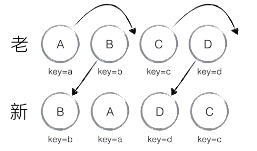

## dom-diff

### 使用

```shell
npm start
```

### 原理

- DOM 节点跨层级的移动操作特别少，可以忽略不计
- 拥有相同类的两个组件将会生成相似的树形结构，拥有不同类的两个组件将会生成不同的树形结构
- 对于同一层级的一组子节点，它们可以通过唯一key进行区分
- DIFF算法在执行时有三个维度，分别是Tree DIFF、Component DIFF和Element DIFF，执行时按顺序依次执行，它们的差异仅仅因为DIFF粒度不同、执行先后顺序不同

#### Tree DIFF 

- Tree DIFF是对树的每一层进行遍历，如果某组件不存在了，则会直接销毁


- 当出现节点跨层级移动时，并不会出现想象中的移动操作，而是以 A 为根节点的树被整个重新创建


#### Component DIFF

- 如果是同一类型的组件，按照原策略继续比较
- 类型不同则直接替换


#### Element DIFF 

- 当节点处于同一层级时，React diff 提供了三种节点操作,分别为：  INSERT(插入)、MOVE(移动)和 REMOVE(删除)
  - INSERT: 新的 component 类型不在老集合里， 即是全新的节点，需要对新节点执行插入操作
  - MOVE: 在老集合有新 component 类型，就需要做更新和移动操作，可以复用以前的 DOM 节点
  - REMOVE: 老 component 不在新集合里的，也需要执行删除操作




