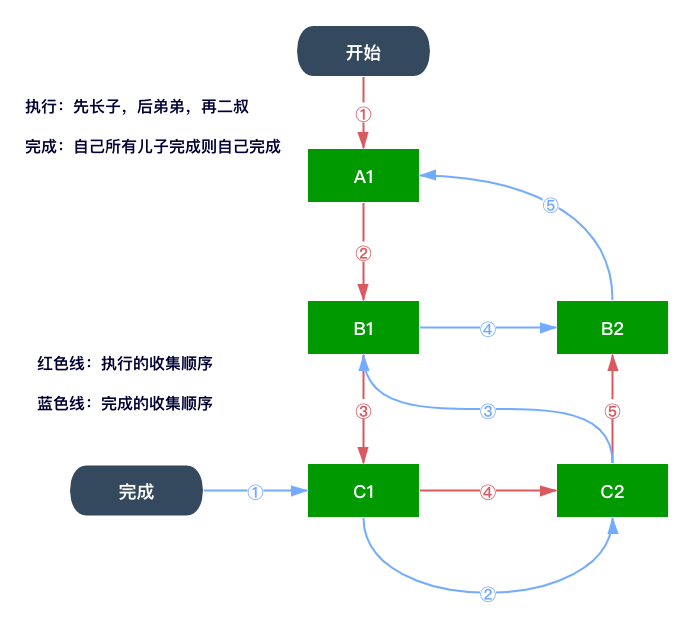

# 由浅入深React的Fiber架构


目的是初识fiber并实现react基础功能，请带着下面几个问题去阅读此文。
- React15存在哪些痛点？Fiber是什么？React16为什么需要引入Fiber？
- 如何实现React16下的虚拟DOM？
- 如何实现Fiber的数据结构和遍历算法？
- 如何实现Fiber架构下可中断和可恢复的的任务调度？
  - 如何指定数量更新？如何批量更新？
- 如何实现Fiber架构下的组件渲染和副作用收集提交？
- 如何实现Fiber中的调和和双缓冲优化策略？
- 如何实现useReducer和useState等Hooks？
- 如何实现expirationTime 任务的优先级 任务调度 超时时间的处理？
- 如何实现reconcile domdiff的优化key处理？
- 如何实现合成事件 SyntheticEvent？
- 如何实现ref useEffect？

## 目录

- [React15的调度策略](#React15的调度策略)
- [浏览器任务调度策略和渲染流程](#浏览器任务调度策略和渲染流程)
- [链表的优势](#链表的优势)
  - [模拟setState](#模拟setState)
- [Fiber架构](#Fiber架构)
  - [Fiber出现前怎么做](#Fiber出现前怎么做)
    - [React15的DOMDIFF](#React15的DOMDIFF)
  - [Fiber是什么](#Fiber是什么)
    - [Fiber是一个执行单元](#Fiber是一个执行单元)
    - [Fiber也是一种数据结构](#Fiber也是一种数据结构)
    - [Fiber小结](#Fiber小结)
  - [Fiber执行阶段](#Fiber执行阶段)
  - [Reconciliation阶段](#Reconciliation阶段)
  - [Commit阶段](#Commit阶段)
- [React使用Fiber](#React使用Fiber)
  - [准备环境](#准备环境)
  - [实现createElement方法](#实现createElement方法)
  - [实现初次渲染](#实现初次渲染)
  - [渲染小结](#渲染小结)
  - [实现元素的更新](#实现元素的更新)
    - [双缓冲更新策略](#双缓冲更新策略)
  - [实现类组件](#实现类组件)
  - [实现函数式组件](#实现函数式组件)
  - [实现Hooks](#实现Hooks)
- [参考资料](#参考资料)

## React15的调度策略

> JavaScript就像一条单行道。

JavaScript是单线程运行的。在浏览器环境中，他需要负责页面的JavaScript解析和执行、绘制、事件处理、静态资源加载和处理。而且只能一个任务一个任务的执行，如果其中某个任务耗时很长，那后面的任务则执行不了，在浏览器端则会呈现卡死的状态。


React15的渲染和diff会递归比对`VirtualDOM树`，**找出有增删改的节点，然后同步更新他们**，整个过程是一气呵成的。那么如果页面节点数量非常庞大，`React`会一直霸占着浏览器资源，一则会导致用户触发的事件得不到响应，二则会导致掉帧，用户会感知到这些卡顿。

所以针对上述痛点，我们期望将**找出有增删改的节点，然后同步更新他们**这个过程分解成两个独立的部分，或者通过某种方式能让整个过程**可中断可恢复的执行**，类似于多任务操作系统的单处理器调度。
> 为了实现进程的并发，操作系统会按照一定的调度策略，将CPU的执行权分配给多个进程，多个进程都有被执行的机会，让他们交替执行，形成一种同时在运行的假象。因为CPU速度太快，人类根本感觉不到。实际上在单核的物理环境下同时只有一个程序在运行。

## 浏览器任务调度策略和渲染流程


玩游戏时需要流畅的刷新率，也就是至少60赫兹。不然游戏体验极差。

那么一个帧包含什么呢？


一帧平均是16.66ms，主要分为以下几个部分
- 脚本执行
- 样式计算
- 布局
- 重绘
- 合成

在样式计算之前会执行脚本计算中使用到`requestAnimationFrame`的callback
  > 如果你还不了解[requestAnimationFrame](https://developer.mozilla.org/zh-CN/docs/Web/API/Window/requestAnimationFrame)，前往mdn查看实现的进度条示例。

在合成后还存在一个`空闲阶段`，即合成及之前的所有步骤耗时若不足`16.66ms`，剩下的时间浏览器为我们提供了`requestIdleCallback`进行调用，对其充分利用。
  > [requestIdleCallback](https://developer.mozilla.org/zh-CN/docs/Web/API/Window/requestIdleCallback)目前只支持chrome，需要[polyfill](https://github.com/careteenL/react/blob/master/packages/fiber/utils/requestIdleCallback.polyfill.js)


大致流程如下：

> [requestIdleCallback示例](https://wiki.developer.mozilla.org/zh-CN/docs/Web/API/Background_Tasks_API)

**requestIdleCallback使开发者能够在主事件循环上执行后台和低优先级工作，而不会影响延迟关键事件，如动画和输入响应。**

## 链表的优势

由于数组的大小是固定的，从数组的起点或者中间插入或移除项的成本很高。链表相对于传统的数组的优势在于添加或移除元素的时候不需要移动其他元素，**需要添加和移除很多元素时，最好的选择是链表，而非数组。** 链表在React的Fiber架构和Hooks实现发挥很大的作用。

> [更多关于链表的实现和使用](https://github.com/careteenL/data-structure_algorithm/blob/0816-leetcode/src/data-structure/linked-list.md)

### 模拟setState


如上可以使用链表实现类似于`React的setState方法`。

```js
// 表示一个节点
class Update {
  constructor(payload, nextUpdate) {
    this.payload = payload
    this.nextUpdate = nextUpdate
  }
}
```
一个节点需要`payload`挂载数据，`nextUpdate`指向下一个节点。
```js
// 模拟链表
class UpdateQueue {
  constructor() {
    this.baseState = null
    this.firstUpdate = null
    this.lastUpdate = null
  }
  enqueue(update) {
    if (!this.firstUpdate) {
      this.firstUpdate = this.lastUpdate = update
    } else {
      this.lastUpdate.nextUpdate = update
      this.lastUpdate = update
    }
  }
}
```
链表初始化时需要`baseState`存放数据，`firstUpdate`指向第一个节点，`lastUpdate`指向最后一个节点。

以及`enqueue`将节点链起来。
```js
const isFunction = (func) => {
  return typeof func === 'function'
}
class UpdateQueue {
  forceUpdate() {
    let currentState = this.baseState || {}
    let currentUpdate = this.firstUpdate
    while(currentUpdate) {
      const nextState = isFunction(currentUpdate.payload) ? currentUpdate.payload(currentState) : currentUpdate.payload
      currentState = {
        ...currentState,
        ...nextState
      }
      currentUpdate = currentUpdate.nextUpdate
    }
    this.firstUpdate = this.lastUpdate = null
    return this.baseState = currentState
  }
}
```
还需要`forceUpdate`将所有节点挂载的数据合并。类似于`React.setState()`参数可对象可函数。

## Fiber架构

### Fiber出现前怎么做

在`React15`及之前，`React`会递归比对`VirtualDOM`树，找出需要变动的节点，然后同步更新它们。这个过程`React`称为`Reconciliation(协调)`。

在`Reconciliation`期间，`React`会一直占用着浏览器资源，一则会导致用户触发的事件得不到响应, 二则会导致掉帧，用户可能会感觉到卡顿。下面将模拟其遍历过程。

#### React15的DOMDIFF


将上图节点结构映射成虚拟DOM
```js
const root = {
  key: 'A1',
  children: [
    {
      key:  'B1',
      children: [
        {
          key: 'C1',
          children: []
        },
        {
          key: 'C2',
          children: []
        }
      ]
    },
    {
      key:  'B2',
      children: []
    }
  ]
}
```
采用深度优先算法对其遍历
> [详解DFS](https://github.com/careteenL/data-structure_algorithm/blob/0816-leetcode/src/algorithm/recursion/dfs-bfs.md#dfs)
```js
function walk(vdom, cb) {
  cb && cb(vdom)
  vdom.children.forEach(child => walk(child, cb))
}
// Test
walk(root, (node) => {
  console.log(node.key) // A1 B1 C1 C2 B2
})
```
在`Dom-Diff`时也是如此递归遍历对比，且存在两个非常影响性能的问题。
- 树节点庞大时，会导致递归调用执行栈越来越深
- 不能中断执行，页面会等待递归执行完成才重新渲染
> [详解React的Dom-Diff](https://github.com/careteenL/react/tree/master/examples/dom-diff)

### Fiber是什么

- Fiber是一个执行单元
- Fiber也是一种数据结构

#### Fiber是一个执行单元

上面`浏览器任务调度过程`提到在页面合成后还存在一个空闲阶段`requestIdleCallback`。

下图为React结合空闲阶段的调度过程


这是一种**合作式调度**，需要程序和浏览器互相信任。浏览器作为领导者，会分配执行时间片（即requestIdleCallback）给程序去选择调用，程序需要按照约定在这个时间内执行完毕，并将控制权交还浏览器。

Fiber是一个执行单元，每次执行完一个执行单元，React就会检查现在还剩多少时间，如果没有时间就将控制权交还浏览器；然后继续进行下一帧的渲染。

#### Fiber也是一种数据结构


React中使用链表将`Virtual DOM`链接起来，每一个节点表示一个Fiber

```js
class FiberNode {
  constructor(type, payload) {
    this.type = type // 节点类型
    this.key = payload.key // key
    this.payload = payload // 挂载的数据
    this.return = null // 父Fiber
    this.child = null // 长子Fiber
    this.sibling = null // 相邻兄弟Fiber
  }
}

// Test
const A1 = new FiberNode('div', { key: 'A1' })
const B1 = new FiberNode('div', { key: 'B1' })
const B2 = new FiberNode('div', { key: 'B2' })
const C1 = new FiberNode('div', { key: 'C1' })
const C2 = new FiberNode('div', { key: 'C2' })

A1.child = B1
B1.return = A1
B1.sibling = B2
B1.child = C1
B2.return = A1
C1.return = B1
C1.sibling = C2
C2.return =  B1
```

#### Fiber小结
- 我们可以通过某些调度策略合理分配CPU资源，从而提高用户的响应速度
- 通过Fiber架构，让自己的Reconciliation过程变得可被中断，适时地让出CPU执行权，可以让浏览器及时地响应用户的交互

### Fiber执行阶段

每次渲染有两个阶段：`Reconciliation`（协调/render）阶段和`Commit`（提交）阶段

- 协调/render阶段：可以认为是Diff阶段，这个阶段可以被中断，这个阶段会找出所有节点变更，例如节点增删改等等，这些变更在React中称为Effect（副作用）。
- 提交阶段：将上一个阶段计算出来的需要处理的副作用一次性执行。这个阶段不能中断，必须同步一次性执行完。


### Reconciliation阶段

下面将上面讲到的几个知识点串联起来使用。
> 此阶段测试例子[fiberRender.html](https://github.com/careteenL/react/tree/master/packages/fiber/utils/fiberRender.html)，核心代码存放[fiberRender.js](https://github.com/careteenL/react/tree/master/packages/fiber/utils/fiberRender.js)。

上面`Fiber也是一种数据结构`小结已经构建了Fiber树，然后来开始遍历，在第一次渲染中，所有操作类型都是新增。
> 根据`Virtual DOM`去构建`Fiber Tree`

```js
nextUnitOfWork = A1
requestIdleCallback(workLoop, { timeout: 1000 })
```
空闲时间去遍历收集`A1`根节点
```js
function workLoop (deadline) {
  // 这一帧渲染还有空闲时间 || 没超时 && 还存在一个执行单元
  while ((deadline.timeRemaining() > 0 || deadline.didTimeout) && nextUnitOfWork) {
    nextUnitOfWork = performUnitOfWork(nextUnitOfWork) // 执行当前执行单元 并返回下一个执行单元
  }
  if (!nextUnitOfWork) {
    console.log('render end !')
  } else {
    requestIdleCallback(workLoop, { timeout: 1000 })
  }
}
```
- 当满足`这一帧渲染还有空闲时间或没超时 && 还存在一个执行单元`时去执行当前执行单元 并返回下一个执行单元。
- 不满足上面条件后若还存在一个执行单元，会继续下一帧的渲染。
  - 不存在执行单元时，此阶段完成。

```js
function performUnitOfWork (fiber) {
  beginWork(fiber) // 开始
  if (fiber.child) {
    return fiber.child
  }
  while (fiber) {
    completeUnitOfWork(fiber) // 结束
    if (fiber.sibling) {
      return fiber.sibling
    }
    fiber = fiber.return
  }
}
function beginWork (fiber) {
  console.log('start: ', fiber.key)
}
function completeUnitOfWork (fiber) {
  console.log('end: ', fiber.key)
}

```

遍历执行单元流程如下
1. 从根节点开始遍历
1. 如果没有长子，则标识当前节点遍历完成。`completeUnitOfWork`中收集
1. 如果没有相邻兄弟，则返回父节点标识父节点遍历完成。`completeUnitOfWork`中收集
1. 如果没有父节点，标识所有遍历完成。`over`
1. 如果有长子，则遍历；`beginWork`中收集；收集完后返回其长子，回到`第2步`循环遍历
1. 如果有相邻兄弟，则遍历；`beginWork`中收集；收集完后返回其长子，回到`第2步`循环遍历

执行的收集顺序如下
> 类似[二叉树的先序遍历](https://github.com/careteenL/data-structure_algorithm/blob/0816-leetcode/src/data-structure/binary-search-tree.js#L129)
```js
function beginWork (fiber) {
  console.log('start: ', fiber.key) // A1 B1 C1 C2 B2
}
```


完成的收集顺序如下
> 类似[二叉树的后序遍历](https://github.com/careteenL/data-structure_algorithm/blob/0816-leetcode/src/data-structure/binary-search-tree.js#L163)
```js
function completeUnitOfWork (fiber) {
  console.log('end: ', fiber.key) // C1 C2 B1 B2 A1
}
```

### Commit阶段

类似于`Git`的分支功能，从旧树里面fork一份，在新分支中进行**添加、删除、更新**操作，然后再进行提交。


> 此阶段测试例子[fiberCommit.html](https://github.com/careteenL/react/tree/master/packages/fiber/utils/fiberCommit.html)，核心代码存放[fiberCommit.js](https://github.com/careteenL/react/tree/master/packages/fiber/utils/fiberCommit.js)。

先构造根fiber，`stateNode`表示当前节点真实dom。
```js
let container = document.getElementById('root')
workInProgressRoot = {
  key: 'ROOT',
  // 节点实例(状态)：
  //        对于宿主组件，这里保存宿主组件的实例, 例如DOM节点
  //        对于类组件来说，这里保存类组件的实例
  //        对于函数组件说，这里为空，因为函数组件没有实例
  stateNode: container,
  props: { children: [A1] }
}
nextUnitOfWork = workInProgressRoot // 从RootFiber开始，到RootFiber结束
```

如上一个阶段的`beginWork`收集过程，对其进行完善。即将所有节点fiber化。
```js
function beginWork(currentFiber) { // ++
  if (!currentFiber.stateNode) {
    currentFiber.stateNode = document.createElement(currentFiber.type) // 创建真实DOM
    for (let key in currentFiber.props) { // 循环属性赋赋值给真实DOM
      if (key !== 'children' && key !== 'key')
        currentFiber.stateNode.setAttribute(key, currentFiber.props[key])
    }
  }
  let previousFiber
  currentFiber.props.children.forEach((child, index) => {
    let childFiber = {
      tag: 'HOST',
      type: child.type,
      key: child.key,
      props: child.props,
      return: currentFiber,
      // 当前节点的副作用类型，例如节点更新、删除、移动
      effectTag: 'PLACEMENT',
      // 和节点关系一样，React 同样使用链表来将所有有副作用的Fiber连接起来
      nextEffect: null
    }
    if (index === 0) {
      currentFiber.child = childFiber
    } else {
      previousFiber.sibling = childFiber
    }
    previousFiber = childFiber
  })
}
```
其中`effectTag`标识当前节点的副作用类型，第一次渲染为新增`PLACEMENT`，`nextEffect`标识下一个有副作用的节点。

然后再完善`completeUnitOfWork`（完成的收集）。
```js
function completeUnitOfWork(currentFiber) { // ++
  const returnFiber = currentFiber.return
  if (returnFiber) {
    if (!returnFiber.firstEffect) {
      returnFiber.firstEffect = currentFiber.firstEffect
    }
    if (currentFiber.lastEffect) {
      if (returnFiber.lastEffect) {
        returnFiber.lastEffect.nextEffect = currentFiber.firstEffect
      }
      returnFiber.lastEffect = currentFiber.lastEffect
    }

    if (currentFiber.effectTag) {
      if (returnFiber.lastEffect) {
        returnFiber.lastEffect.nextEffect = currentFiber
      } else {
        returnFiber.firstEffect = currentFiber
      }
      returnFiber.lastEffect = currentFiber
    }
  }
}
```
目的是将完成的收集形成一个链表结构，配合`commitRoot`阶段。

当将所有的`执行、完成`收集完成后（即将所有真实DOM、虚拟DOM、Fiber结合，其副作用（增删改）形成一个链表结构），需要对其渲染到页面中。
```js
function workLoop (deadline) {
  // ...
  if (!nextUnitOfWork) {
    console.log('render end !')
    commitRoot()
  } else {
    requestIdleCallback(workLoop, { timeout: 1000 })
  }
}
```

找到第一个副作用完成的fiber节点，递归`appendChild`到父元素上。
```js
function commitRoot() { // ++
  let fiber = workInProgressRoot.firstEffect
  while (fiber) {
    console.log('complete: ', fiber.key) // C1 C2 B1 B2 A1
    commitWork(fiber)
    fiber = fiber.nextEffect
  }
  workInProgressRoot = null
}
function commitWork(currentFiber) {
  currentFiber.return.stateNode.appendChild(currentFiber.stateNode)
}
```
如下为上述的渲染效果和打印完成的收集顺序


## React使用Fiber

### 准备环境

使用`react-create-app`创建一个项目`fiber`

```js
// src/index.js
import React from 'react'
let element = (
  <div id="A1">
    <div id="B1">
      <div id="C1"></div>
      <div id="C2"></div>
    </div>
    <div id="B2"></div>
  </div>
)
console.log(element)
```
`npm i && npm start`之后打印结果如下


借用脚手架的babel编译，我们直接写`JSX语法`代码。

### 实现createElement方法

在`babel`编译时将`JSX`语法转为一个对象，然后调用react下的`React.createElement`方法构建虚拟dom。我们可以如下模拟：

```js
// core/react.js
const ELEMENT_TEXT = Symbol.for('ELEMENT_TEXT')
function createElement(type, config, ...children) {
  return {
    type, // 元素类型
    props: {
      ...config,
      children: children.map(
        child => typeof child === "object" ?
          child :
          { type: ELEMENT_TEXT, props: { text: child, children: [] } })
    }
  }
}

let React = {
  createElement
}
export default React
```
如果`children`中有child是一个`React.createElement`返回的`React元素`，且是字符串的话，会被转成文本节点。

### 实现初次渲染

准备如下结构
```js
// src/index.js
import React from 'react'
import ReactDOM from 'react-dom'
let style = { border: '3px solid green', margin: '5px' }
let element = (
  <div id="A1" style={style}>
    A1
    <div id="B1" style={style}>
      B1
      <div id="C1" style={style}>C1</div>
      <div id="C2" style={style}>C2</div>
    </div>
    <div id="B2" style={style}>B2</div>
  </div>
)
ReactDOM.render(
  element,
  document.getElementById('root')
)
```
期望的渲染结果


此时需要定义一些列常量
```js
// core/constants.js
export const ELEMENT_TEXT = Symbol.for('ELEMENT_TEXT') // 文本元素
export const TAG_ROOT = Symbol.for('TAG_ROOT') // 根Fiber
export const TAG_HOST = Symbol.for('TAG_HOST') // 原生的节点 span div p 函数组件 类组件
export const TAG_TEXT = Symbol.for('TAG_TEXT') // 文本节点
export const PLACEMENT = Symbol.for('PLACEMENT') // 插入节点
```

然后借助上述的`Reconciliation阶段`，在`react-dom.js`中先将虚拟dom构建成一根fiber树
```js
// core/react-dom.js
import { TAG_ROOT } from './constants'
import { scheduleRoot } from './scheduler'
function render(element, container) {
  let rootFiber = {
    tag: TAG_ROOT, // 这是根Fiber
    stateNode: container, // 此Fiber对应的DOM节点
    props: { children: [element] }, // 子元素就是要渲染的element
  }
  scheduleRoot(rootFiber)
}

export default {
  render
}
```
然后交由`scheduleRoot`进行调度
```js
// core/scheduler.js
// ...
```
代码量较多，主要为`Reconciliation阶段`和`Commit阶段`的组合代码。
> [此过程代码存放地址](./backup/scheduler.js)

其中对`beginWork`进行细化
```js
function beginWork(currentFiber) {
  if (currentFiber.tag === TAG_ROOT) { // 如果是根节点
    updateHostRoot(currentFiber)
  } else if (currentFiber.tag === TAG_TEXT) { // 如果是原生文本节点
    updateHostText(currentFiber)
  } else if (currentFiber.tag === TAG_HOST) { // 如果是原生DOM节点
    updateHostComponent(currentFiber)
  }
}
function updateHostRoot(currentFiber) { // 如果是根节点
  const newChildren = currentFiber.props.children // 直接渲染子节点
  reconcileChildren(currentFiber, newChildren)
}
function updateHostText(currentFiber) {
  if (!currentFiber.stateNode) {
    currentFiber.stateNode = createDOM(currentFiber) // 先创建真实的DOM节点
  }
}
function updateHostComponent(currentFiber) { // 如果是原生DOM节点
  if (!currentFiber.stateNode) {
    currentFiber.stateNode = createDOM(currentFiber) // 先创建真实的DOM节点
  }
  const newChildren = currentFiber.props.children
  reconcileChildren(currentFiber, newChildren)
}
```
其中主要是针对不同类型节点赋值给`stateNode`

- 原生DOM节点/原生文本节点：直接创建真是DOM节点赋值给`stateNode`
- 下面将会对其进行扩展
  - 类组件：需要new一个组件实例挂载到`stateNode`
  - 函数式组件：没有实例，`stateNode`为null

`reconcileChildren`也是对不同类型节点做处理。

### 渲染小结
再次巩固下上一节的两个阶段及调度规则
- 从根节点开始渲染和调度主要有两个阶段
  - **render阶段：此阶段比较花时间，我们可以对任务进行拆分，拆分的维度虚拟DOM。此阶段借助`requestIdleCallback`可以实现暂停**
  - **diff阶段：对比新旧的虚拟DOM，进行增量、更新、创建**
- **render阶段成果是`effect list`，收集节点的增删改**
- **render阶段有两个任务**
  - **根据虚拟DOM生成fiber树**
  - **收集`effectlist`**
- **commit阶段，进行DOM更新创建阶段，此阶段不能暂停，要一气呵成**

调度规则
- **遍历链规则：先长子、后兄弟、再二叔**
- **完成链规则：所有儿子全部完成，则自己完成**
- **effect链：同完成链**

### 实现元素的更新

**其中使用到双缓冲优化策略，下面将重点介绍**
> 类似于图形化领域绘制引擎常用的**双缓冲技术**。先将图片绘制到一个缓冲区，再一次性传递给屏幕进行显示，这样可以防止屏幕抖动，优化渲染性能。

操作页面进而重新渲染，期望第一次更新为`变更A1/B1/C1/C2、新增B3`，第二次更新为`变更A1/B1/C1/C2、删除B3`。


对应新增代码如下
```html
<!-- public/index.html -->
<div id="root"></div>
<button id="reRender1">reRender1</button>
<button id="reRender2">reRender2</button>
<button id="reRender3">reRender3</button>
```
为两个按钮绑定事件，重新渲染页面
```js
// src/index.js
let reRender2 = document.getElementById('reRender2')
reRender2.addEventListener('click', () => {
  let element2 = (
    <div id="A1-new" style={style}>
      A1-new
      <div id="B1-new" style={style}>
        B1-new
        <div id="C1-new" style={style}>C1-new</div>
        <div id="C2-new" style={style}>C2-new</div>
      </div>
      <div id="B2" style={style}>B2</div>
      <div id="B3" style={style}>B3</div>
    </div>
  )
  ReactDOM.render(
    element2,
    document.getElementById('root')
  )
})

let reRender3 = document.getElementById('reRender3')
reRender3.addEventListener('click', () => {
  let element3 = (
    <div id="A1-new2" style={style}>
      A1-new2
      <div id="B1-new2" style={style}>
        B1-new2
        <div id="C1-new2" style={style}>C1-new2</div>
        <div id="C2-new2" style={style}>C2-new2</div>
      </div>
      <div id="B2" style={style}>B2</div>
    </div>
  )
  ReactDOM.render(
    element3,
    document.getElementById('root')
  )
})
```

#### 双缓冲更新策略


- 将每次渲染完后的fiber树赋值给`currentRoot`
- 第一次更新时将`rooterFiber`的`alternate`指向`上一次渲染好的currentRoot`
- 第二次之后的更新将`workInProgressRoot`指向`currentRoot.alternate`，然后将当前的`workInProgressRoot.alternate`指向`上一次渲染好的currentRoot`
- ...
- 进而达到复用fiber对象树

<details>
<summary>变动代码如下</summary>

```diff
import { setProps } from './utils'
import {
    ELEMENT_TEXT, TAG_ROOT, TAG_HOST, TAG_TEXT, PLACEMENT, DELETION, UPDATE
} from './constants'
+let currentRoot = null // 当前的根Fiber
let workInProgressRoot = null // 正在渲染中的根Fiber
let nextUnitOfWork = null // 下一个工作单元
+let deletions = [] // 要删除的fiber节点

export function scheduleRoot(rootFiber) {
// {tag:TAG_ROOT,stateNode:container,props: { children: [element] }}
+  if (currentRoot && currentRoot.alternate) { // 偶数次更新
+    workInProgressRoot = currentRoot.alternate
+    workInProgressRoot.firstEffect = workInProgressRoot.lastEffect = workInProgressRoot.nextEffect = null
+    workInProgressRoot.props = rootFiber.props
+    workInProgressRoot.alternate = currentRoot
+  } else if (currentRoot) { // 奇数次更新
+    rootFiber.alternate = currentRoot
+    workInProgressRoot = rootFiber
+  } else {
+    workInProgressRoot = rootFiber // 第一次渲染
+  }
    nextUnitOfWork = workInProgressRoot
}

function commitRoot() {
+  deletions.forEach(commitWork)
  let currentFiber = workInProgressRoot.firstEffect
  while (currentFiber) {
    commitWork(currentFiber)
    currentFiber = currentFiber.nextEffect
  }
+  deletions.length = 0 // 先把要删除的节点清空掉
+  currentRoot = workInProgressRoot
  workInProgressRoot = null
}
function commitWork(currentFiber) {
  if (!currentFiber) {
    return
  }
  let returnFiber = currentFiber.return // 先获取父Fiber
  const domReturn = returnFiber.stateNode // 获取父的DOM节点
  if (currentFiber.effectTag === PLACEMENT && currentFiber.stateNode != null) { // 如果是新增DOM节点
    let nextFiber = currentFiber
    domReturn.appendChild(nextFiber.stateNode)
+  } else if (currentFiber.effectTag === DELETION) { // 如果是删除则删除并返回
+      domReturn.removeChild(currentFiber.stateNode)
+  } else if (currentFiber.effectTag === UPDATE && currentFiber.stateNode != null) { // 如果是更新
+    if (currentFiber.type === ELEMENT_TEXT) {
+      if (currentFiber.alternate.props.text != currentFiber.props.text) {
+        currentFiber.stateNode.textContent = currentFiber.props.text
+      }
+    } else {
+      updateDOM(currentFiber.stateNode, currentFiber.alternate.props, currentFiber.props)
+    }
+  }
  currentFiber.effectTag = null
}

function reconcileChildren(currentFiber, newChildren) {
  let newChildIndex = 0 // 新虚拟DOM数组中的索引
+  let oldFiber = currentFiber.alternate && currentFiber.alternate.child // 父Fiber中的第一个子Fiber
+  let prevSibling
+  while (newChildIndex < newChildren.length || oldFiber) {
+    const newChild = newChildren[newChildIndex]
+    let newFiber
+    const sameType = oldFiber && newChild && newChild.type === oldFiber.type // 新旧都有，并且元素类型一样
+    let tag
+    if (newChild && newChild.type === ELEMENT_TEXT) {
+      tag = TAG_TEXT // 文本
+    } else if (newChild && typeof newChild.type === 'string') {
+      tag = TAG_HOST // 原生DOM组件
+    }
+    if (sameType) {
+      if (oldFiber.alternate) {
+        newFiber = oldFiber.alternate
+        newFiber.props = newChild.props
+        newFiber.alternate = oldFiber
+        newFiber.effectTag = UPDATE
+        newFiber.nextEffect = null
+      } else {
+        newFiber = {
+          tag:oldFiber.tag, // 标记Fiber类型，例如是函数组件或者原生组件
+          type: oldFiber.type, // 具体的元素类型
+          props: newChild.props, // 新的属性对象
+          stateNode: oldFiber.stateNode, // 原生组件的话就存放DOM节点，类组件的话是类组件实例，函数组件的话为空，因为没有实例
+          return: currentFiber, // 父Fiber
+          alternate: oldFiber, // 上一个Fiber 指向旧树中的节点
+          effectTag: UPDATE, // 副作用标识
+          nextEffect: null  // React 同样使用链表来将所有有副作用的Fiber连接起来
+        }
# +      }
+      } else {
+        if (newChild) { // 类型不一样，创建新的Fiber,旧的不复用了
+          newFiber = {
+            tag, // 原生DOM组件
+            type: newChild.type, // 具体的元素类型
+            props: newChild.props, // 新的属性对象
+            stateNode: null, // stateNode肯定是空的
+            return: currentFiber, // 父Fiber
+            effectTag: PLACEMENT // 副作用标识
+          }
+        }
+        if (oldFiber) {
+          oldFiber.effectTag = DELETION
+          deletions.push(oldFiber)
+        }
+      }
+      if (oldFiber) {   // 比较完一个元素了，老Fiber向后移动1位
+        oldFiber = oldFiber.sibling
+      }
    if (newFiber) {
      if (newChildIndex === 0) {
        currentFiber.child = newFiber // 第一个子节点挂到父节点的child属性上
      } else {
        prevSibling.sibling = newFiber
      }
      prevSibling = newFiber // 然后newFiber变成了上一个哥哥了
    }
    prevSibling = newFiber // 然后newFiber变成了上一个哥哥了
    newChildIndex++
  }
}
```
</details>

### 实现类组件


构建一个计数器
```js
class ClassCounter extends React.Component {
  constructor(props) {
    super(props)
    this.state = { number: 0 }
  }
  onClick = () => {
    this.setState(state => ({ number: state.number + 1 }))
  }
  render() {
    return (
      <div id="counter">
        <span>{this.state.number}</span>
        <button onClick={this.onClick}>加1</button>
      </div >
    )
  }
}
ReactDOM.render(
  <ClassCounter />,
  document.getElementById('root')
)
```

```diff
import { ELEMENT_TEXT } from './constants'
+import { Update, UpdateQueue } from './updateQueue'
+import { scheduleRoot } from './scheduler'
// ...
+class Component {
+  constructor(props) {
+    this.props = props
+    this.updateQueue = new UpdateQueue()
+  }
+  setState(payload) {
+    this.internalFiber.updateQueue.enqueueUpdate(new Update(payload))
+    scheduleRoot()
+  }
+}
+Component.prototype.isReactComponent = true
let React = {
    createElement,
+  Component
}
export default React
```
此过程在[模拟setState](#模拟setState)过程已经说明
```js
export class Update {
  constructor(payload) {
    this.payload = payload
  }
}
// 数据结构是一个单链表
export class UpdateQueue {
  constructor() {
    this.firstUpdate = null
    this.lastUpdate = null
  }
  enqueueUpdate(update) {
    if (this.lastUpdate === null) {
      this.firstUpdate = this.lastUpdate = update
    } else {
      this.lastUpdate.nextUpdate = update
      this.lastUpdate = update
    }
  }
  forceUpdate(state) {
    let currentUpdate = this.firstUpdate
    while (currentUpdate) {
      let nextState = typeof currentUpdate.payload === 'function' ? currentUpdate.payload(state) : currentUpdate.payload
      state = { ...state, ...nextState }
      currentUpdate = currentUpdate.nextUpdate
    }
    this.firstUpdate = this.lastUpdate = null
    return state
  }
}
```
需要在`src/scheduler.js`文件中做如下修改
```diff
function beginWork(currentFiber) {
  if (currentFiber.tag === TAG_ROOT) { // 如果是根节点
    updateHostRoot(currentFiber)
  } else if (currentFiber.tag === TAG_TEXT) { // 如果是原生文本节点
    updateHostText(currentFiber)
  } else if (currentFiber.tag === TAG_HOST) { // 如果是原生DOM节点
    updateHostComponent(currentFiber)
+  } else if (currentFiber.tag === TAG_CLASS) { // 如果是类组件
+    updateClassComponent(currentFiber)
+  }
}
+function updateClassComponent(currentFiber) {
+  if (currentFiber.stateNode === null) {
+    currentFiber.stateNode = new currentFiber.type(currentFiber.props)
+    currentFiber.stateNode.internalFiber = currentFiber
+    currentFiber.updateQueue = new UpdateQueue()
+  }
+  currentFiber.stateNode.state = currentFiber.updateQueue.forceUpdate(currentFiber.stateNode.state)
+  const newChildren = [currentFiber.stateNode.render()]
+  reconcileChildren(currentFiber, newChildren)
+}
```
如果是类组件，则new这个类将实例缓存到`currentFiber.stateNode`，再将`实例的render()方法执行结果`递归调度`reconcileChildren`

### 实现函数式组件

同类组件一样，在各对应地方新增一份`else..if`即可
```js
function FunctionCounter() {
  return (
    <h1>
      Count:0
    </h1>
  )
}
ReactDOM.render(
  <FunctionCounter />,
  document.getElementById('root')
)
```
```diff
function beginWork(currentFiber) {
  if (currentFiber.tag === TAG_ROOT) { // 如果是根节点
    updateHostRoot(currentFiber)
  } else if (currentFiber.tag === TAG_TEXT) { // 如果是原生文本节点
    updateHostText(currentFiber)
  } else if (currentFiber.tag === TAG_HOST) { // 如果是原生DOM节点
    updateHostComponent(currentFiber)
  } else if (currentFiber.tag === TAG_CLASS) { // 如果是类组件
    updateClassComponent(currentFiber)
+  } else if (currentFiber.tag === TAG_FUNCTION) { // 如果是函数组件
+    updateFunctionComponent(currentFiber)
+  }
}
+function updateFunctionComponent(currentFiber) {
+  const newChildren = [currentFiber.type(currentFiber.props)]
+  reconcileChildren(currentFiber, newChildren)
+}
```
与类组件不一样的是函数式组件没有实例，故直接将函数执行的返回值递归调度。

### 实现Hooks

使用如下
```js
// src/index.js
import React from '../../../packages/fiber/core/react'
import ReactDOM from '../../../packages/fiber/core/react-dom'

function reducer(state, action) {
  switch (action.type) {
    case 'ADD':
      return { count: state.count + 1 }
    default:
      return state
  }
}
function FunctionCounter() {
  const [numberState, setNumberState] = React.useState({ number: 0 })
  const [countState, dispatch] = React.useReducer(reducer, { count: 0 })
  return (
    <div>
      <h1 onClick={() => setNumberState(state => ({ number: state.number + 1 }))}>
        Count: {numberState.number}
      </h1 >
      <hr />
      <h1 onClick={() => dispatch({ type: 'ADD' })}>
        Count: {countState.count}
      </h1 >
    </div>
  )
}
ReactDOM.render(
  <FunctionCounter />,
  document.getElementById('root')
)

```
期望的效果为实现两个互不影响的计数器

需要react提供`useState/useReducer`两个Hook
```diff
// core/react.js
+import { scheduleRoot,useState,useReducer} from './scheduler'
let React = {
  createElement,
  Component,
+  useState,
+  useReducer
}
```
实现过程如下
```diff
// core/scheduler.js
+import { UpdateQueue, Update } from './updateQueue'
+let workInProgressFiber = null // 正在工作中的fiber
+let hookIndex = 0              // hook索引
function updateFunctionComponent(currentFiber) {
+  workInProgressFiber = currentFiber
+  hookIndex = 0
+  workInProgressFiber.hooks = []
  const newChildren = [currentFiber.type(currentFiber.props)]
  reconcileChildren(currentFiber, newChildren)
}
+export function useReducer(reducer, initialValue) {
+  let oldHook =
+    workInProgressFiber.alternate &&
+    workInProgressFiber.alternate.hooks &&
+    workInProgressFiber.alternate.hooks[hookIndex]
+  let newHook = oldHook
+  if (oldHook) {
+    oldHook.state = oldHook.updateQueue.forceUpdate(oldHook.state)
+  } else {
+    newHook = {
+      state: initialValue,
+      updateQueue: new UpdateQueue()
+    }
+  }
+  const dispatch = action => {
+    newHook.updateQueue.enqueueUpdate(
+      new Update(reducer ? reducer(newHook.state, action) : action)
+    )
+    scheduleRoot()
+  }
+  workInProgressFiber.hooks[hookIndex++] = newHook
+  return [newHook.state, dispatch]
+}
+export function useState(initState) {
+  return useReducer(null, initState)
+}
```

## 总结

看完上面非常干的简易实现，再来回顾一开始的几个问题：
- [x] React15存在哪些痛点？Fiber是什么？React16为什么需要引入Fiber？
  - 渲染和diff阶段一气呵成，节点树庞大时会导致页面卡死
  - Fiber并不神秘，只是将Virtual-DOM转变为一种链表结构
  - 链表结构配合requestIdleCallback可实现可中断可恢复的调度机制
- [x] 如何实现React16下的虚拟DOM？
  - 同React15
- [x] 如何实现Fiber的数据结构和遍历算法？
  - 见[Fiber也是一种数据结构](#Fiber也是一种数据结构)图
- [x] 如何实现Fiber架构下可中断和可恢复的的任务调度？
  - [x] 如何指定数量更新？如何批量更新？
  - 借助requestIdleCallback交由浏览器在一帧渲染后的给出的空闲时间内实现指定数量跟新，批量更新可以直接跳过这个API，按之前的方式
- [x] 如何实现Fiber架构下的组件渲染和副作用收集提交？
  - 执行的收集顺序类似于二叉树的先序遍历
  - 完成的收集顺序类似于二叉树的后序遍历
- [x] 如何实现Fiber中的调和和双缓冲优化策略？
  - 在Fiber结构中增加一个alternate字段标识上一次渲染好的Fiber树，下次渲染时可复用
- [x] 如何实现useReducer和useState等Hooks？
- [ ] 如何实现expirationTime 任务的优先级 任务调度 超时时间的处理？
- [ ] 如何实现reconcile domdiff的优化key处理？
- [ ] 如何实现合成事件 SyntheticEvent？
- [ ] 如何实现ref useEffect？

但仍然还有后面几个问题没有解答，下篇文章继续探索...

## 参考资料

- [facebook/react](https://github.com/facebook/react)
- [React Fiber架构 -司徒正美](https://zhuanlan.zhihu.com/p/37095662)
- [这可能是最通俗的 React Fiber(时间分片) 打开方式](https://juejin.im/post/5dadc6045188255a270a0f85)
